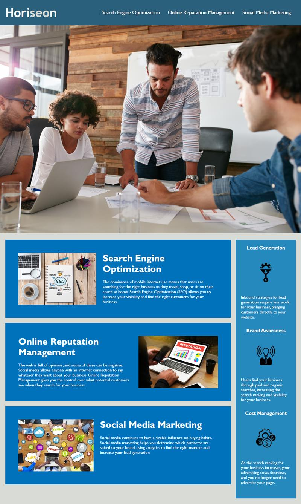

# <Challenge>

## Description

This challenge is made to fix HTML, and CSS semantic elements, and also made them easy to read.

I fixed the most div to the semantic elements like header, nav, main, section, aside, footer, h1, h2, h3, etc.. I have fixed all links functions correctly, and CSS selectors and properties are consolidated and organized to follow a semantic structure.

I have learned the basic skill to check every element by using it correctly and making the code cleaner.

## Installation

N/A

## Usage

## Credits

N/A

## License

Please refer to the LICENSE in the repo.
